# Glow. — Beauty Salon Management System

A full-featured beauty salon management system.  
Manage customers, staff, appointments, services, products, suppliers, payments, notifications, audit logs, and AI-powered style analysis — all from a polished admin portal.

**Brand:** Glow. · Beauty Salon

---

## Features

| Module                     | Description                                                                 |
|----------------------------|-----------------------------------------------------------------------------|
| **Dashboard**              | Live overview — total appointments, active customers, revenue, staff members + AI StyleDNA quick access |
| **User Management**        | Register, login, role-based access (Admin / Customer), search & filter by role/status |
| **Customer Management**    | Customer profiles, phone, linked user, status + Chrono Style (AI Face & Style analysis) |
| **Staff Management**       | Staff profiles with specialization, bio, experience, availability status |
| **Supplier Management**    | Supplier details, contact person, phone, email, status |
| **Category Management**    | Service & product categories (Hair, Skin, Nail Care, Makeup, Body Care, etc.) |
| **Service Management**     | Services with price, duration, category, status |
| **Appointment Management** | Book, view, filter by status/date, AI assist button |
| **Appointment Details**    | Line-item management for services under each appointment |
| **Product Management**     | Products with images, category, supplier, price, quantity, low-stock alerts |
| **Payments & Billing**     | Record payments for completed appointments, discounts, payment history |
| **Notifications Center**   | System alerts, low-stock warnings, appointment reminders, mark as read |
| **Audit Log**              | Full trail of who did what and when (CREATE / UPDATE / DELETE actions) |
| **Customer Feedback**      | Ratings, comments, average rating, 5-star review tracking |

---

## Screenshots

> **Note:** Screenshots ටික තවම upload කරලා නැත්නම් පහත images පෙන්නේ නැහැ. පස්සේ upload කරන්න.

### Login & Sign Up
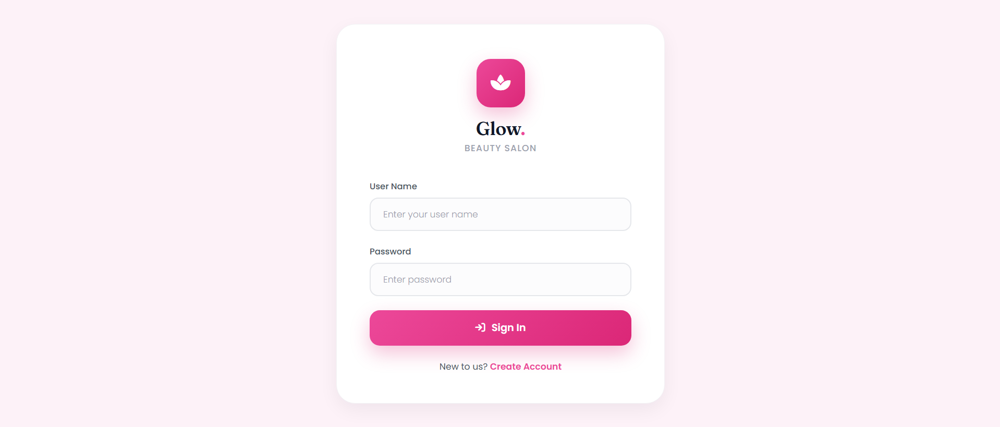
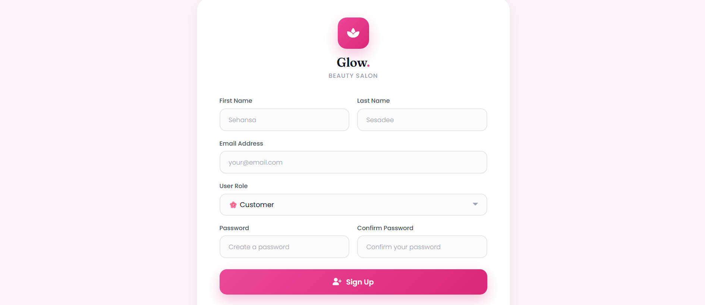

### Dashboard
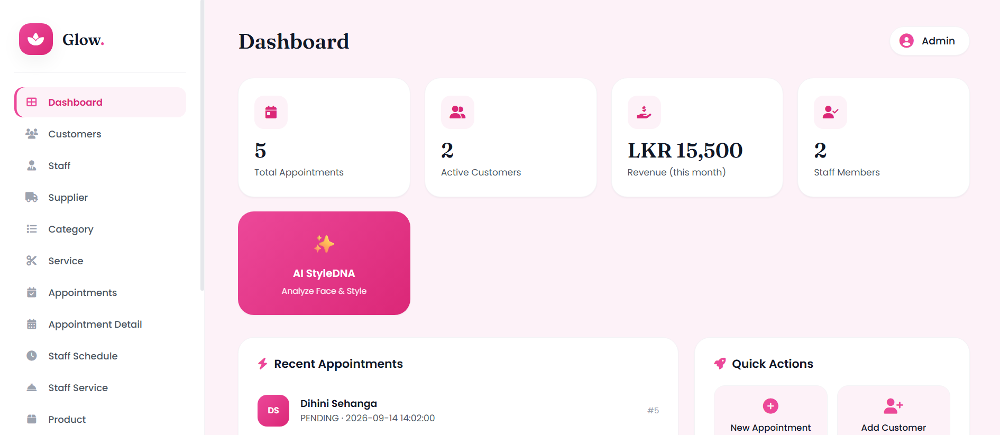

### Customer Management
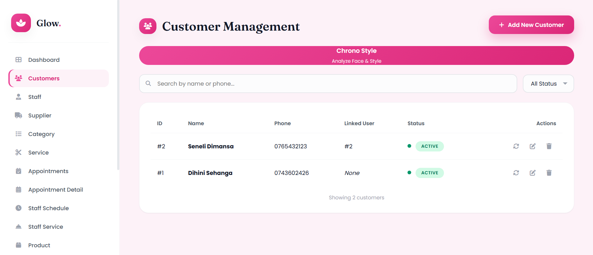

### Staff Management
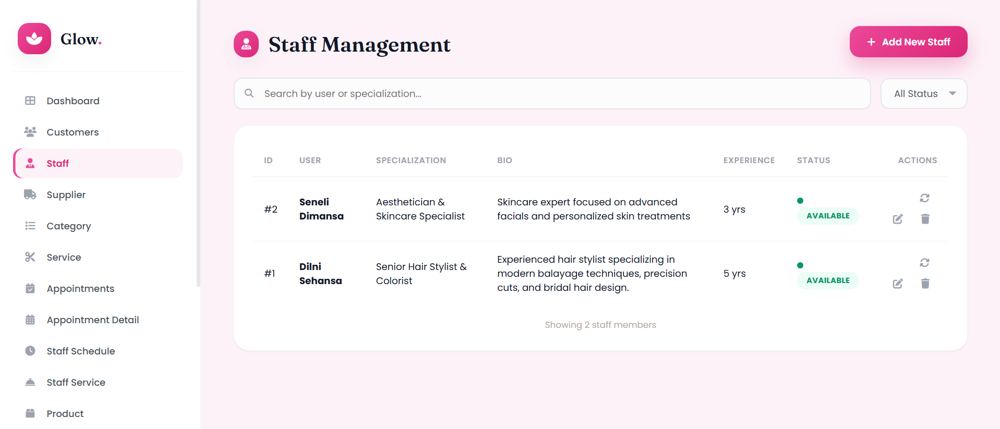

### Supplier Management
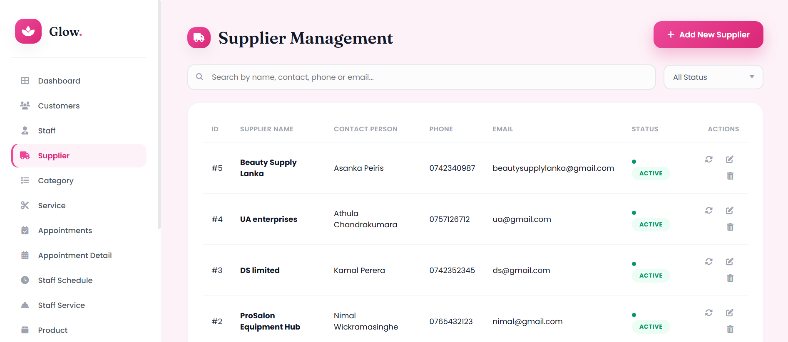

### Category & Service Management
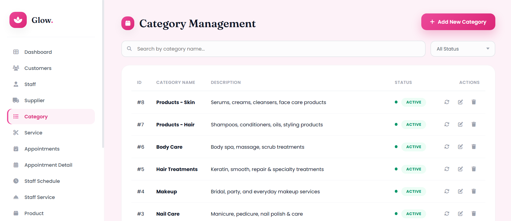
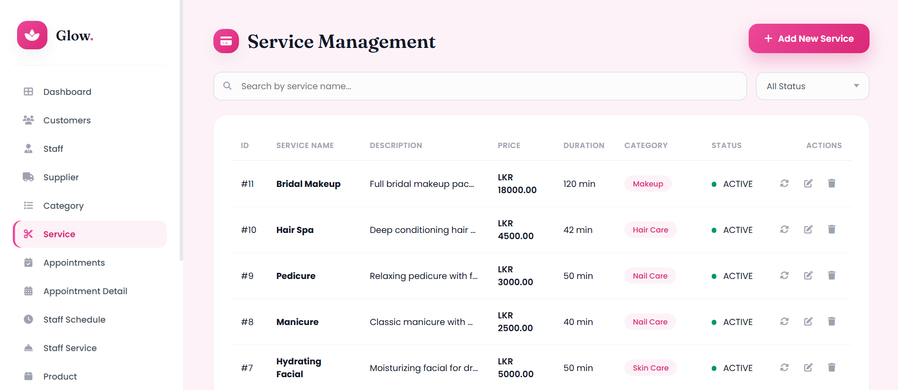

### Appointment Management
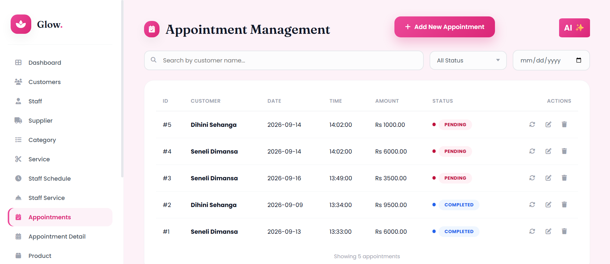
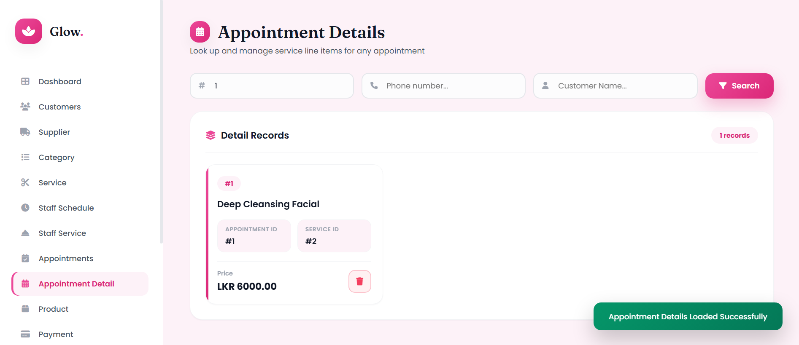

### Product Management
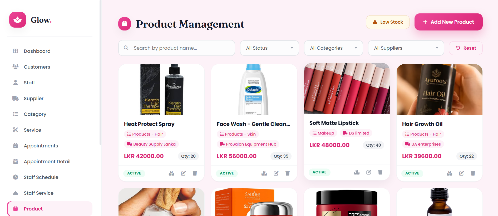

### Payments & Billing
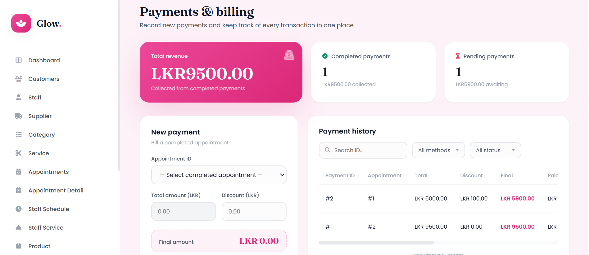

### Notifications & Audit Log
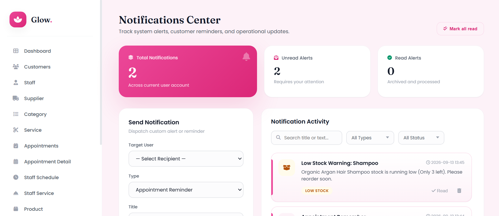
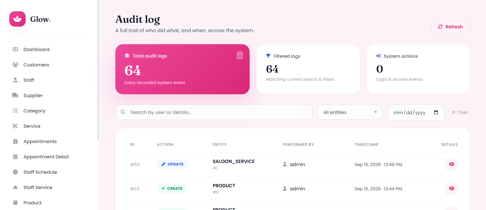

### Customer Feedback
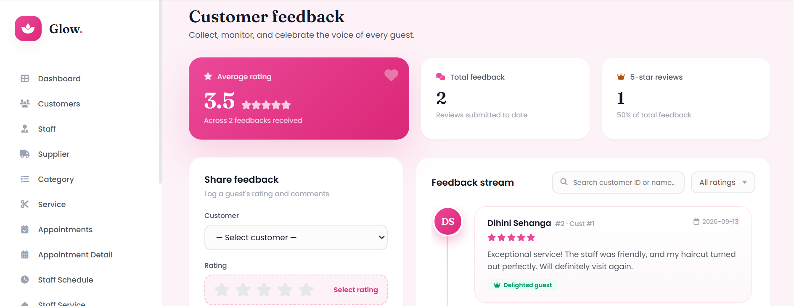

---

## Tech Stack

| Layer       | Technology                          |
|-------------|-------------------------------------|
| Backend     | Spring Boot 3.x, Java 17            |
| Security    | Spring Security + JWT + BCrypt      |
| Persistence | Spring Data JPA + Hibernate         |
| Database    | MySQL                               |
| Email       | Spring Mail (Gmail SMTP)            |
| AI          | Google Gemini / custom StyleDNA     |
| Frontend    | Static HTML + JavaScript (served by Spring) |
| Build       | Maven                               |
| Utilities   | Lombok                              |

---

## Project Structure

```text
Spring-Salon-Project/
├── src/main/java/com/example/glow/
│   ├── controller/          # REST API endpoints
│   ├── service/ & impl/     # Business logic
│   ├── repository/          # JPA repositories
│   ├── entity/              # Database entities
│   ├── dto/                 # Data Transfer Objects
│   ├── security/            # JWT filter & SecurityConfig
│   ├── config/              # Web / CORS config
│   └── enumeration/         # Roles, statuses, etc.
├── src/main/resources/
│   ├── static/              # Frontend HTML pages
│   └── application.properties
├── docs/screenshots/        # README screenshots
└── pom.xml
```

---

## Getting Started

**Prerequisites**
- Java 17+
- Maven 3.8+
- MySQL 8+
- Gmail account (for email verification) – optional for local testing
- Google Gemini API key (for AI StyleDNA / Chrono Style) – optional

### 1. Clone the repository
```bash
git clone https://github.com/Dilni-Sehansa/Spring-Salon-Project.git
cd Spring-Salon-Project
```

### 2. Create the database
```sql
CREATE DATABASE glow_beauty_salon;
```

### 3. Configure `application.properties`
```properties
# Database
spring.datasource.url=jdbc:mysql://localhost:3306/glow_beauty_salon?createDatabaseIfNotExist=true
spring.datasource.username=root
spring.datasource.password=YOUR_MYSQL_PASSWORD

# JWT (change this in production!)
jwt.secret=YOUR_LONG_RANDOM_SECRET
jwt.expiration=86400000

# Email (Gmail)
spring.mail.username=YOUR_GMAIL
spring.mail.password=YOUR_APP_PASSWORD
```

### 4. Run the application
```bash
./mvnw spring-boot:run
```
or
```bash
mvn spring-boot:run
```

The app starts at: **http://localhost:8080**

### 5. Open the UI

| Page     | URL                              |
|----------|----------------------------------|
| Login    | http://localhost:8080/login.html |
| Signup   | http://localhost:8080/signup.html |
| Dashboard| http://localhost:8080/dashboard.html |

---

## Authentication

- JWT-based stateless authentication
- Password hashing with BCrypt
- Email verification on registration (optional)
- Protected API endpoints (most routes require a valid Bearer token)

**Public endpoints include:**
- `/v1/users/register/**`
- `/v1/users/login/**`
- `/v1/users/verify/**`
- Static login / signup pages

---

## AI Features

**AI StyleDNA / Chrono Style**

1. Go to Dashboard or Customer Management  
2. Click **AI StyleDNA** or **Chrono Style – Analyze Face & Style**  
3. Upload a photo → AI analyzes face shape, skin tone & recommends suitable styles/services  
4. Results can be linked to the customer profile  

---

## User Roles

| Role     | Description                     |
|----------|---------------------------------|
| ADMIN    | Full system access              |
| STAFF    | Day-to-day operations           |
| CUSTOMER | Book appointments, view history |

---

## Configuration Notes

- File uploads (product images / face analysis): max 10 MB
- CORS: enabled for all origins (adjust for production)
- JPA: `ddl-auto=update` (tables are auto-created/updated)

---

## License

This project is for educational / portfolio purposes.

---

## Author

Built with ❤️ for **Glow. Beauty Salon**.

Feel free to fork, star, and contribute!
